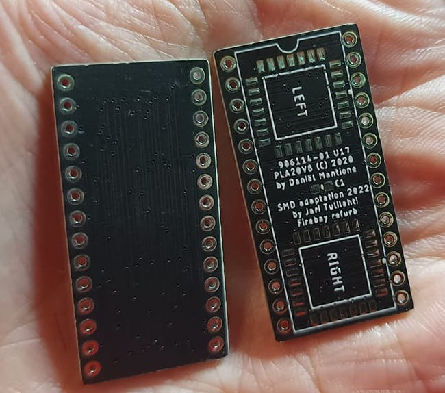

# Commodore 64 GAL-PLA SMD-version

Commodore 64 PLA replacement using GAL20V8B 28-pin PLCC chips. Based on [PLA20V8](https://www.freepascal.org/~daniel/c64pla/) by Daniël Mantione. Published under permission from Daniël.

This version uses 2 pieces of GAL20V8B chips in 28-pin PLCC package. Due to size constraints, soldering the chips is best done by hot air or hot plate, either using solder paste or tinning the pads and using flux. Fuse map is the same as in DIP-version. In the middle of the board there is a footprint for 0603 (optional) bypass capacitor, 0.1-0.22uF.

Fuse map is unchanged, use original Fuse map from [Daniël's site](https://www.freepascal.org/~daniel/c64pla/)

If you want to order PCBs from PCBWay, follow [this link](https://www.pcbway.com/project/shareproject/Commodore_64_PLA_replacement_d4be5faf.html)

This repository includes the Eagle-files for PCB, and also generated Gerbers.

&nbsp;&nbsp;&nbsp;&nbsp;&nbsp;

